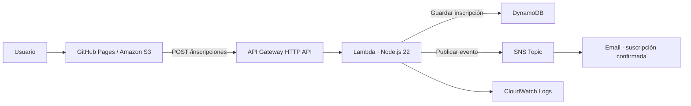

# Luna Cinema · Cine de verano

Proyecto de **Gabriel Galán García · 2SI**, temática asignada: **Cine de verano**.
Landing responsive con ilustración original, sesiones temáticas y formulario real de inscripción.

## Arquitectura



## Enlaces de entrega

Las cuatro URL se guardan en `entrega.json` después del despliegue. El endpoint también está en `web/config.js`: es público y **no es una credencial**.

## Estructura

- `web/`: HTML, CSS, JavaScript e ilustración SVG; se publica en ambos hostings.
- `backend/core.mjs`: validación y flujo de inscripción, independiente del SDK.
- `backend/index.mjs`: acceso real a DynamoDB y SNS con AWS SDK v3 incluido en Lambda.
- `scripts/deploy.py`: despliegue repetible mediante AWS CLI, reutilizando `LabRole`.
- `tests/backend.test.mjs`: pruebas de validación, persistencia, reintentos y fallos SNS.
- `.github/workflows/pages.yml`: publicación de `web/` en GitHub Pages.

## Formulario y API

El cuaderno pide `name`, `email` e `interest`. Se añade consentimiento y un UUID de solicitud para poder reintentar sin duplicar el registro. `interest` admite `clasicos`, `familia`, `descubrimientos` o `todos`.

```json
{
  "name": "Prueba Cine",
  "email": "cine@example.com",
  "interest": "clasicos",
  "consent": true,
  "requestId": "526770f0-f7e0-4aee-8073-89fbc1f4d6aa"
}
```

- `201`: inscripción nueva guardada y mensaje aceptado por SNS.
- `200`: solicitud completada o reintento de una ya completada.
- `400`: JSON, nombre, email, interés, consentimiento o UUID inválidos.
- `409`: UUID reutilizado con otros datos.
- `503`: fallo de servicios o inscripción en proceso; no se anuncia éxito.

El frontend conserva el UUID durante los reintentos del mismo formulario. La clave DynamoDB es `id` (UUID): distribuye escrituras, identifica cada solicitud y permite consultar la inscripción de una respuesta de API. No se usa el email como clave para no limitar a una inscripción por persona. Una escritura condicional impide duplicar el item. Un bloqueo temporal en DynamoDB impide publicaciones simultáneas para el mismo UUID. Si SNS falla, se conserva el registro pendiente y se permite reintentar. SNS Standard y la operación guardar/publicar no ofrecen exactamente una entrega: una interrupción después de publicar y antes de marcar el registro podría duplicar la notificación. Los consumidores deberían usar `id` para deduplicar.

DynamoDB encaja porque se escribe y consulta por identificador, sin joins. Si necesitáramos búsquedas por email o estadísticas, diseñaríamos índices; para relaciones complejas consideraríamos una base relacional.

## Desplegar

Requisitos: AWS CLI, Python 3, Node.js, sesión GitHub y credenciales temporales vigentes de Learner Lab. Las credenciales se configuran **fuera de este repositorio**, mediante el perfil AWS habitual o `AWS_SHARED_CREDENTIALS_FILE`. Nunca se pegan en código, README ni en `config.js`.

```sh
python3 scripts/deploy.py --region us-west-2 --github-owner TU_USUARIO --notification-email TU_EMAIL
```

El script crea tabla, Topic, suscripción, bucket, Lambda y API, configura CORS para los dos hostings y localhost, actualiza el endpoint y sube los archivos estáticos. No ejecuta borrados. Reutiliza recursos con el mismo nombre y la misma cuenta. Configurar GitHub Pages con origen **GitHub Actions**, subir este proyecto a `main` y dejar terminar el workflow. Confirmar la suscripción SNS en el email del responsable.

La lectura pública de S3 se limita a los cinco archivos estáticos; no permite listar el bucket ni acceder a DynamoDB. El endpoint S3 de web estática sirve HTTP. La web de GitHub Pages sirve HTTPS y la API usa HTTPS. La API tiene límites de 2 peticiones/segundo y ráfaga de 5. CORS limita los orígenes de navegador; **no es autenticación** ni una defensa contra llamadas directas. Este formulario público es una demostración académica; para tráfico real habría que añadir protección antiabuso y revisar retención y privacidad.

TTL marca los registros para eliminación a los 30 días; DynamoDB elimina de forma asíncrona. El TTL no elimina mensajes ya entregados por correo. SNS notifica al responsable del proyecto; los visitantes no se añaden como suscriptores al Topic.

## IAM y diagnóstico

Las credenciales temporales Academy permiten al alumno crear los recursos. Lambda usa **LabRole** como Execution Role para ejecutar `dynamodb:PutItem`, `GetItem`, `UpdateItem`, `sns:Publish` y escribir logs. Se reutiliza el rol autorizado por el laboratorio; el script no crea roles administrativos ni amplía sus permisos. API Gateway invoca Lambda mediante una resource policy restringida a esta API y `POST /inscripciones`.

- `400`: revisar el cuerpo enviado en Network.
- `403` / `AccessDenied`: revisar qué identidad realizó la acción y sus permisos.
- `404`: revisar URL y ruta `POST /inscripciones`.
- `503`: buscar el `id` devuelto en logs y el item DynamoDB; comprobar estado de notificación.
- CORS: revisar el origen exacto y preflight OPTIONS; no añadir `*` a ciegas.
- `ResourceNotFound`: revisar nombres de tabla/Topic y región.

Los logs guardan `id`, ID de invocación y MessageId SNS, sin nombre ni email. El Topic contiene los datos del formulario para el responsable.

## Comprobación

```sh
node --test tests/backend.test.mjs
python3 -m http.server 4173 --directory web
```

Para demostrar la entrega se debe probar el formulario **publicado**, localizar el mismo `id` en DynamoDB, ver `notificationStatus: sent` y `snsMessageId`, localizar la invocación en CloudWatch y comprobar el correo SNS recibido con ese `id`. Un resultado correcto de `SNS Publish` acredita aceptación por el servicio; la suscripción confirmada y el email recibido acreditan la entrega al destinatario. Usar datos ficticios en las pruebas.

Este proyecto incluye una propuesta de programación, sin fechas, precios o películas inventados como si fueran un evento real.
